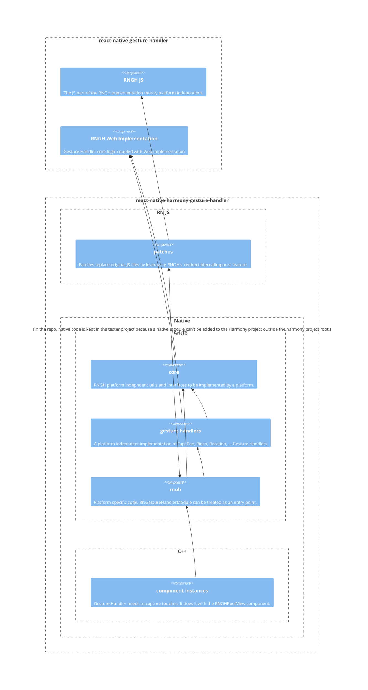

# React Native Harmony Gesture Handler

## Target Audience
RNH Gesture Handler Maintainers.

## Related Links
- public repo of this project: https://github.com/react-native-oh-library/react-native-harmony-gesture-handler
- documentation: https://gitee.com/react-native-oh-library/usage-docs/blob/master/en/react-native-gesture-handler.md

## Common Questions 
### Why does the repo on GitLab exists if there's already a repo on GitHub?
GitLab repo was created first by the SWM team. GitHub repo was created later by the Huawei team.
Both repos aren't in sync. For example the version on GitLab supports RNOH 0.77 whereas the version on GitHub does not.
In the long run, GitLab version needs to be removed on the work should continue on the GitHub version.

### Why is the main logic of Gesture Handler handled on the ArkTS side?
This project started before the introduction of the C-API architecture in RNOH.

### Why are the docs in a different repo?
`¯\_(ツ)_/¯`

## Context
This project was developed alongside RNOH. It was treated with lower priority than RNOH. The developer experience may suffer because of that.
When this project started, there were two available approaches:
- rewriting Gesture Handler from scratch (the codebase is a mess, state pattern should have been used and the core logic should be platform independent and covered with unit tests)
- reusing existing Gesture Handler codebase as much as possible

The second approach was chosen from the following reasons:
- Gesture Handler logic is quite complicated with many edge cases, and no proper test suite existed in the original repo.
- It required less work to deliver the requested at that moment functionality.
- Web implementation of the Gesture Handler can be shared after some adaptation if this project is merged with RNGH

## Architecture
If you can't see the diagram copy the code below and display it for example here: https://mermaid.live/

## Running the `tester` app

### Installing unreleased RNOH

If RNOH@0.77 was released, update package.json and remove this instruction. Otherwise:

1. Go to RNOH repo and follow setup instructions for RNOH Maintainers
1. Create `react-native-oh-react-native-harmony-0.77.X.tgz` (probably `pnpm pack` in `<RNOH_REPO>/packages/react-native-harmony`)
1. Create `react-native-oh-react-native-harmony-cli-0.77.X.tgz` (probably `pnpm pack` in `<RNOH_REPO>/packages/react-native-harmony-cli`)
1. Copy and paste those artifacts to `./packages`
1. Update paths to those artifacts in `react-native-harmony-gesture-handler/package.json` and in `tester/package.json`

### Installing dependencies and preparing development environment

1. Go to `/tester`
1. Run `npm run i`
1. Open `tester/harmony` in DevEco Studio

### Generate signing config

1. Open `File -> Project Structure -> Signing Configs`
2. Log in to your Huawei developer account and proceed with provided instructions

### Running the app

1. Go to `/tester`
2. Run `npm run start`
3. Open `tester/harmony` in DevEco Studio
4. Build and run `entry` module
